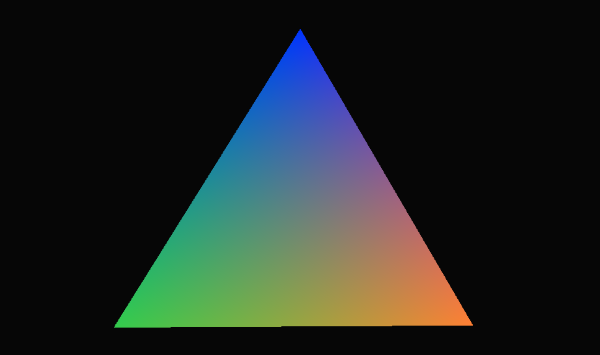

Vulkan Experimentation
----------------------

Playing around with [Vulkan](https://www.khronos.org/vulkan/).

Also polishing my C++, multithreading, and Windows development skills.

That's the plan, anyway.

References
----------

* SaschaWillems's Excellent [Vulkan examples](https://github.com/SaschaWillems/Vulkan)
* LunarG's [Vulkan SDK Docs](https://vulkan.lunarg.com/app/docs/latest/)
* LunarG's [Vulkan Samples](https://github.com/LunarG/VulkanSamples)
* NVIDIA DesignWorks's [Samples](https://github.com/nvpro-samples)
* NVIDIA's Vulkan [landing page](https://developer.nvidia.com/Vulkan)

Progress
--------

2/26/2016: Got triangle sample (from SaschaWillems's [Vulkan demos](https://github.com/SaschaWillems/Vulkan/tree/master/triangle)) building and running with some custom
CMake setup on Windows 10 with Visual Studio 2015.

